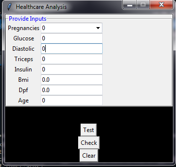

# Healthcare Analysis using Software Aid
Fittness is one of the major concerns of present time. The purpose of this was to promote and enhance the healthcare facilities for both patients and doctors. A prediction model is made which examines the features or symptoms in some cases to yield the result by showing the health status or with any disease, a person might have in coming years. This project presents the data based on the study of parameters on which diabetes depends and is employed to detect the probability of diabetes for an individual.

## Basic Working
The purpose was to create an application which can model a neural network on the basis of user inputs and then model can be further used for contemporary data prediction and analysis.

To make the application, we have used the Python language and worked in Spyder. Keras libraries are used to model the neural network. Firstly a model was created and training was done on it. After achieving a certain amount of accuracy the final model is loaded. Then a Graphical User Interface was created which was required to fetch user input and based on the saved model, the predictions were done.

## Dependencies

- Anaconda (Spyder)
- Keras and Tensorflow
- Python, Matplot, Seaborn and Pandas
- Numpy
- Tkinter(GUI interaction)

## Install

Load Anaconda software and open Spyder environment. Copy the given code and save as '.py' file, import the required libraries, like 'numpy' as 'np'. 

After saving the code and making appropriate changes according to your requirement, run it and view the output on GUI after filling the required fields. 
